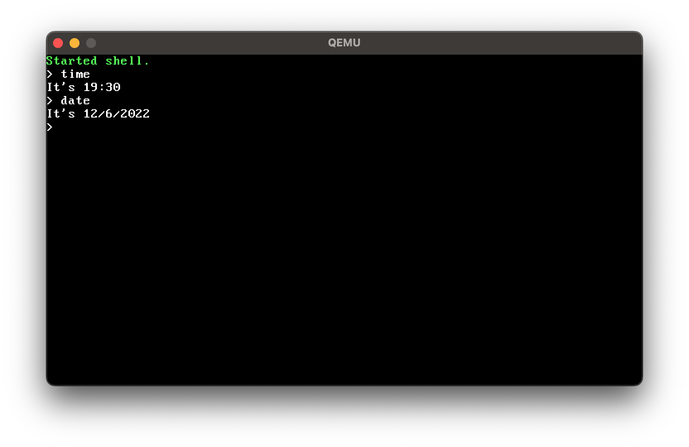

# loofOS
A novice OS.

**CURRENT WORK:** I am programming drivers, syscalls, and also trying to port this over to 64 bit.

**NOTE:** Currently I have paused work on the ARM arch kernel, as qemu for some reason decided to leave out emulation for the timer (bcm2837). Without the timer, I will not be able to test out context switching, multitasking, nor will I be able to write the scheduler. So until I find a solution that doesn't involve overwriting the kernel of my only ARM system that I need for development, I will be dropping all work on that end.

### Building
Just `make` at the root path of the repo to see what architectures are currently available. Then, do `make <arch>`. Also, the Makefile is incredibly scuffed, so basically you will need to compile on an `ARM` system in order to compile for `ARM` and you will need the LLVM and cross compile toolchain in order to compile for `x86`.

### Running
Currently, the only supported architecture is 32bit `ARMv7l` and `x86`. Also, the drivers for `ARM` will only work on a raspberry pi board (rpi 2/3, bcm2835-7). I will try to add a device tree in the future and more drivers for different devices. It is recommended that you use the qemu emulator to test/run.
#### For ARM
```sh
# Run with qemu emulator
qemu-system-aarch64 -M raspi2 -kernel PATH/TO/KERNEL
```
#### For x86
```sh
# Run with qemu emulator also
qemu-system-i386 -cdrom build/x86/loof.iso -m 4G
```

### Checklist
(Will expand in the future)
- Bootloader (DONE ARM, DONE x86)
- Processes (DONE x86)
- Scheduler (DONE x86)
- Paging (DONE x86)
- Drivers
	- Serial Output (DONE ARM, DONE x86)
    - Display (In Progress x86)
	- Keyboard (In Progress x86)
	- Hard-disk (In Progress x86)
	- Terminal (In Progress x86)
- Filesystem (In Progress x86)
- Shell (In Progress x86)
- Syscalls (In Progress x86)

### Contributing
#### For ARM
For the peripherals and programming the drivers, refer to the documentation for bcm2837 or the header files under `include/peripherals`. Provide verbose comments.
#### For x86
For the peripherals and programming the drivers, uh just look at some driver specifications online and the intel manuals. Again, you can look at the current implementation for reference or for help.
