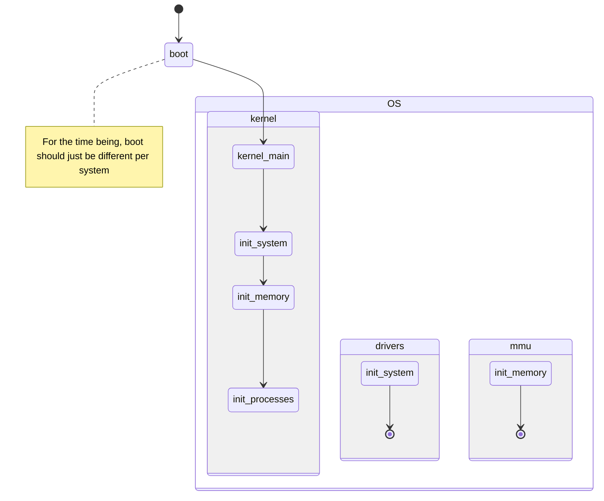

# LoofOS Kernel Design stuff
Some stuff about the design considerations of loofOS. It will hopefully prevent the codebase from becoming a clusterheck of badness. Also just testing ground of design.

## Project structure
Kernel/Driver separation
- The kernel code, controlling the logic of processes and memory, **should be separate** from all hardware related stuff
- In other words, if the system changes, the kernel code should remain the same

## Processes and Threads
- No process or thread hierarchy.
	- Process and threads can spawn threads and processes, but there will be no parent or child structure.
	- Many-to-one model will be used
- Interprocess communication will consist of global mailboxes attached to each process (total of 4KiB mailboxes per process)
	- Mailboxes will remain in a "closed" state until they are opened by a read request.
	- The 0th, 1st, and 2nd mailboxes will be stdout, stdin, and stderr, respectively.
	- For the kernel, there will also be mailboxes, but only accessible by the kernel.
- Round robin scheduler design will be used

## Memory
TODO
